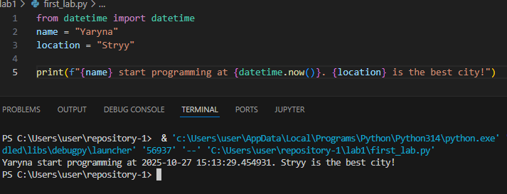
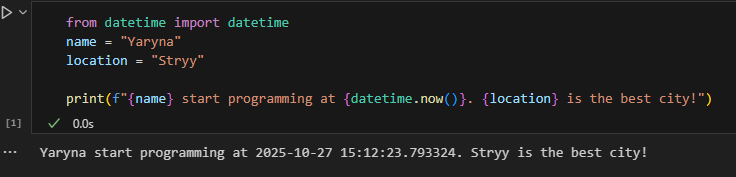

# Звіт до лабораторної роботи №1

## Тема роботи: Налаштування середовища, прочаток роботи з Python та Markdown;
## Мета роботи: Налаштувати середовище роботи VS Code, створити репозиторій Github та налаштувати інтеграцію з ним, написати першу програму на Python та створити звіт з використанням форматування Markdown;

### Виконання роботи

- **Результати виконання завдання №1** 



- **Результат виконання завдання №2**




- **Результат виконання завдання №3**

# Програма від Chat GPT

Якби я писав свою першу програму, то вона виглядала б так:

```python
name = input("Як тебе звати? ")
print(f"Радий познайомитися, {name}! 🤖")


## 🔍 Пояснення:

Ця програма:

Запитує ім’я користувача.

Виводить привітання з використанням введеного імені.

Це проста, але "людяна" програма — вона демонструє, як комп’ютер може взаємодіяти з користувачем через введення та виведення даних.


Запропонована програма від AI виконується✅