# Звіт до лабораторної роботи №2

## Тема роботи
**Основи програмування на Python**

## Мета роботи
Навчитись застосовувати основні конструкції мови Python, виконати всі приклади та з використанням AI створити власні приклади, які демонструють особливості кодових конструкцій Python.

---

## Виконання роботи

### Завдання №1
Результати виконання:  
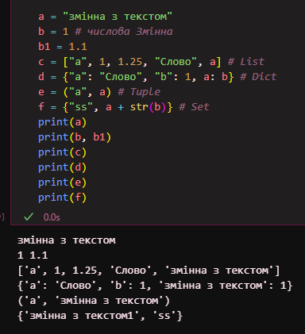

---

### Завдання №2
Результати виконання:  
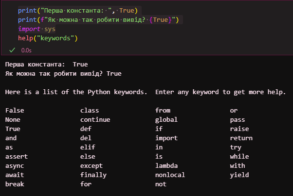  
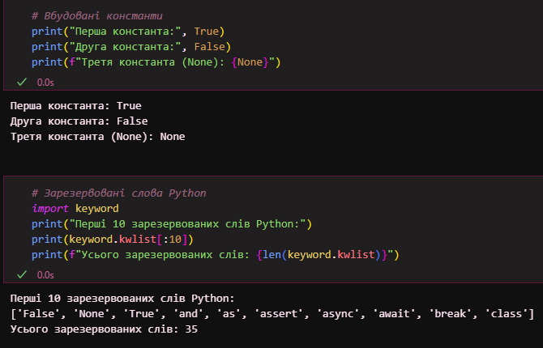

---

### Завдання №3
Результати виконання:  
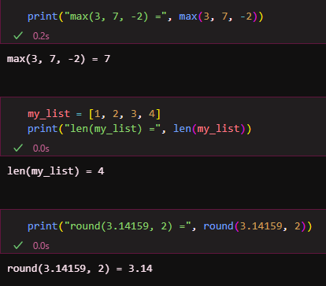

---

### Завдання №4
Результати виконання:  
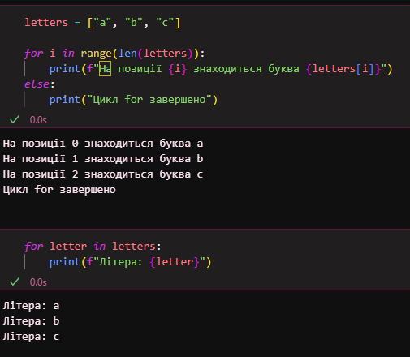

---

### Завдання №5
Результати виконання:  
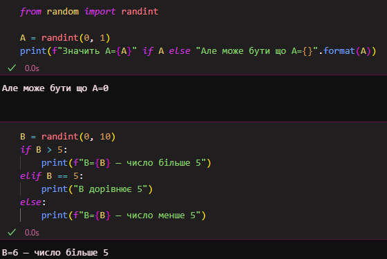  

---

### Завдання №6
Результати виконання:  
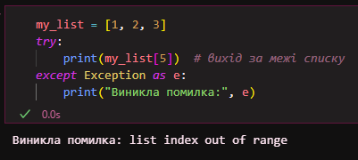

---

### Завдання №7
Результати виконання:  
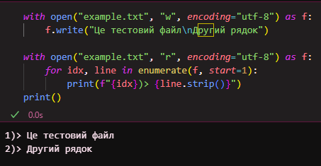

---

### Завдання №8
Результати виконання:  
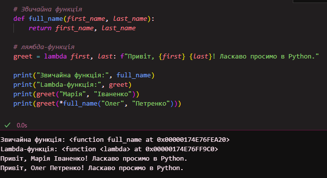

---

### Завдання №9

Результати виконання:  
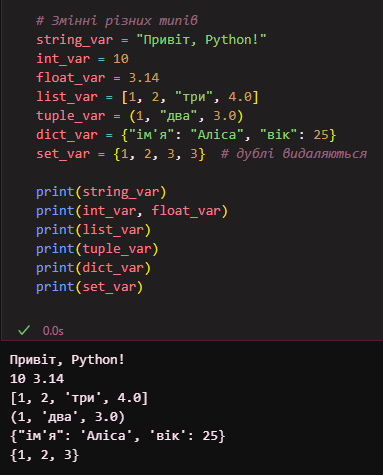  
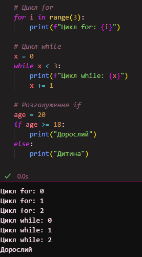  
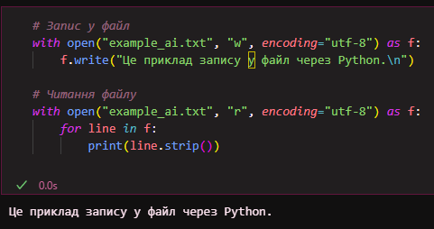  

AI пояснив, що для початку Python у Jupyter Notebook важливо практикуватися з:  

- **Типами даних:** `int`, `float`, `str`, `list`, `tuple`, `dict`, `set`  
- **Циклами та умовами:** `for`, `while`, `if/else`  
- **Функціями та lambda-функціями**  
- **Файловими операціями** через `with`  

Ці приклади можна виконати в Notebook, і вони демонструють базові можливості Python у зручному інтерактивному середовищі.

## Висновок

У ході лабораторної роботи №2 було виконано практичні завдання, що дозволили ознайомитися з основами програмування на Python.  
Було опрацьовано роботу з базовими типами даних, списками, словниками, кортежами та множинами, використано цикли, розгалуження, обробку помилок через `try/except/finally`, контекст-менеджери `with` та lambda-функції.  
Мета роботи — навчитися застосовувати основні конструкції Python та створювати власні приклади — досягнута. Було отримано практичний досвід у роботі з даними, функціями та файлами, а також у використанні базових інструментів мови для вирішення завдань.  
Усі ключові питання лабораторної роботи були розглянуті, а завдання виконані та продемонстровані у звіті у вигляді прикладів коду та скріншотів.
