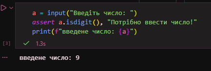
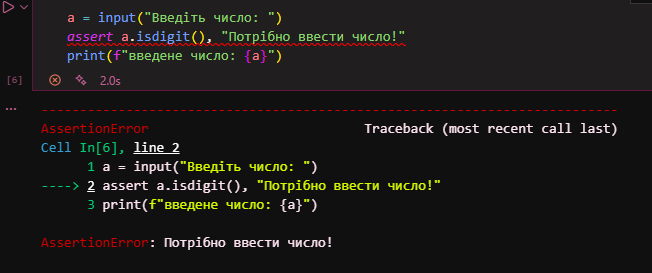
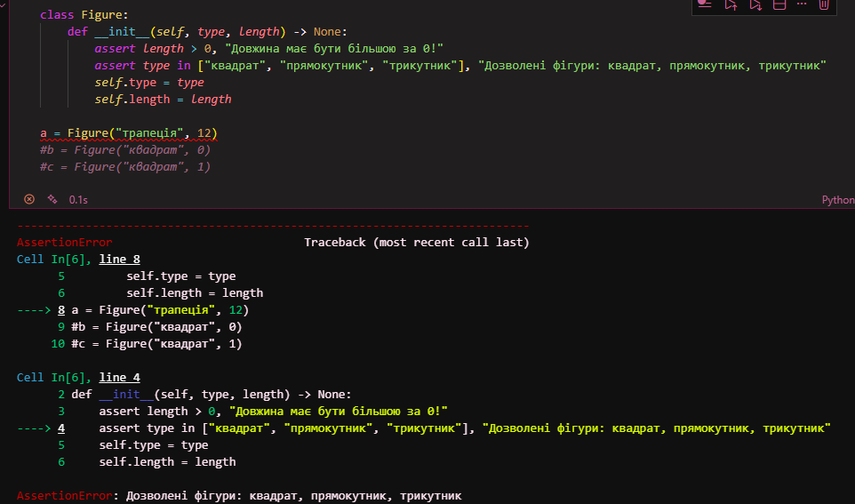
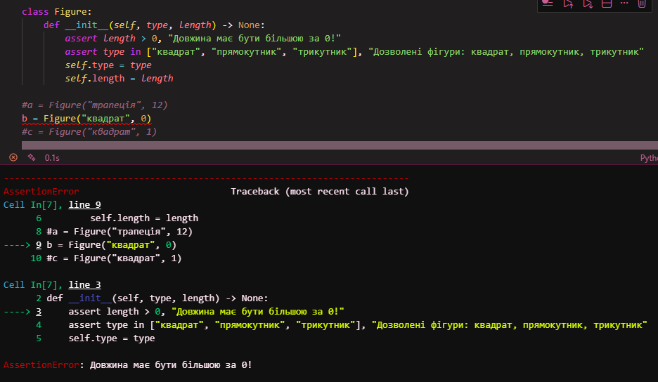
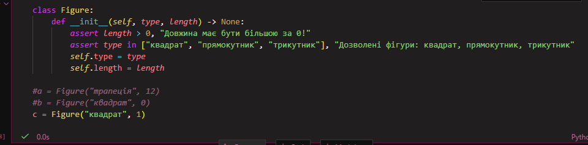
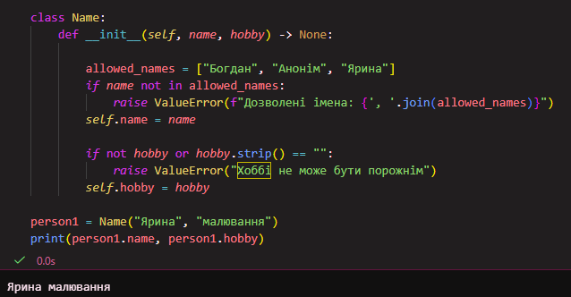
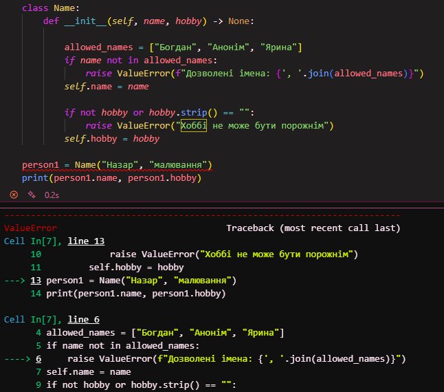
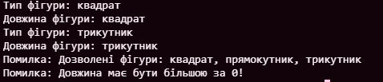
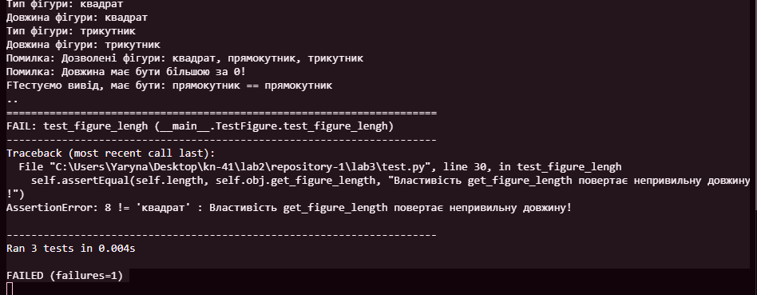

# Звіт до лабораторної роботи №1

## Тема роботи: Налаштування середовища, прочаток роботи з Python та Markdown;
## Мета роботи: Налаштувати середовище роботи VS Code, створити репозиторій Github та налаштувати інтеграцію з ним, написати першу програму на Python та створити звіт з використанням форматування Markdown;

### Виконання роботи

### Завдання №1
Результати виконання: 

### Завдання №2
Результати виконання: 

### Завдання №3
Результати виконання:

 

### Завдання №4
Результати виконання:

class Figure:
    FIGURES = ["квадрат", "прямокутник", "трикутник"]
    def __init__(self, type, length) -> None:
        assert length > 0, "Довжина має бути більшою за 0!"
        assert type in self.FIGURES, "Дозволені фігури: квадрат, прямокутник, трикутник"
        self.type = type
        self.length = length

    @property
    def get_figure_type(self):
        return self.type

    @property
    def get_figure_length(self):
        return self.type # робимо помилку

fig1 = Figure("квадрат", 5)
print("Тип фігури:", fig1.get_figure_type)   
print("Довжина фігури:", fig1.get_figure_length)  

fig2 = Figure("трикутник", 3)
print("Тип фігури:", fig2.get_figure_type)   
print("Довжина фігури:", fig2.get_figure_length)  

try:
    fig3 = Figure("коло", 4)
except AssertionError as e:
    print("Помилка:", e)

try:
    fig4 = Figure("квадрат", 0)
except AssertionError as e:
    print("Помилка:", e)

### Перевірка роботи класу за допомогою юніт тестів.

import unittest
from random import choice, randint

from app import Figure # назва файлу з нашим класом повинна бути app.py

class TestFigure(unittest.TestCase):
    @classmethod
    def setUpClass(cls):
        """Виконається лише раз на початку тестів
        """
        pass
    
    def setUp(self) -> None:
        """Виконується кожного разу коли запускається тест
        """
        self.figure = choice(Figure.FIGURES)
        self.length = randint(1, 10)
        self.obj = Figure(self.figure, self.length)
        return super().setUp()

    def tearDown(self) -> None:
        del self.obj
        return super().tearDown()

    def test_figure_type(self):
        print(f"Тестуємо вивід, має бути: {self.figure} == {self.obj.get_figure_type}")
        self.assertEqual(self.figure, self.obj.get_figure_type, "Властивість get_figure_type повертає непривильну фігуру!")

    def test_figure_lengh(self):
        self.assertEqual(self.length, self.obj.get_figure_length, "Властивість get_figure_length повертає непривильну довжину!")
    
    def test_obj(self):
        with self.assertRaises(AssertionError):
            Figure("коло", 1) 

if __name__ == '__main__':
    unittest.main() 

